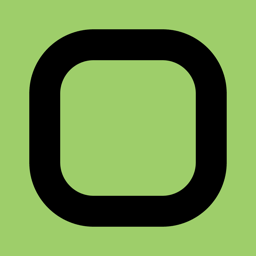
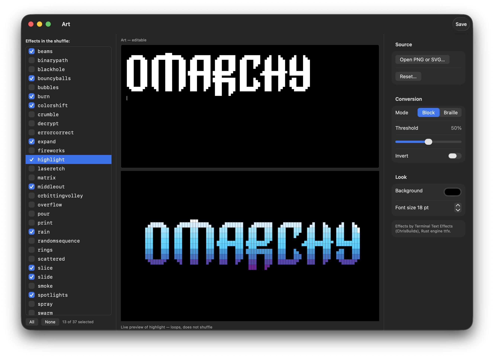

<!-- LOGO -->
<h1>
<p align="center">
  
  <br>Omacy
</h1>
  <p align="center">
    A macOS screensaver that plays Omarchy’s ASCII text-effects loop.
    <br />
    Your logo, or any art, animated by the 37 Terminal Text Effects.
    <br />
    <a href="#install">Install</a>
    ·
    <a href="#status">Status</a>
    ·
    <a href="#build">Build</a>
    ·
    <a href="CONTRIBUTING.md">Contributing</a>
  </p>
</p>

<p align="center">
  <video src="assets/animation.mp4" width="880" autoplay loop muted playsinline>
    <a href="assets/animation.mp4">Omacy demo</a>
  </video>
</p>

## Features

- **A real screensaver.** Host app plus a `com.apple.screensaver` appex, listed in System Settings. Not a preview window pretending to be idle.
- **The Omarchy loop.** All 37 Terminal Text Effects, running on a Metal cell grid. Same motion as the Linux screensaver, including the default wordmark.
- **Your art.** Paste ASCII, or convert a PNG or SVG to block or Braille. Restore the default whenever you want.
- **Install from the host.** Drop `Omacy.app` in `/Applications`, register the extension, enable it. Configuration lives in the app because the converter needs `NSOpenPanel`.

See [architecture](docs/architecture.md), [FFI](docs/ffi.md), and [parity](docs/parity.md) for the engine contract.

<p align="center">
  
</p>

## Install

Requires macOS 15 (Sequoia) or later.

1. Build the app (see [Build](#build)), or use a signed build from [Releases](https://github.com/dedene/omacy-screensaver/releases) when one exists.
2. Put `Omacy.app` in `/Applications`.
3. Open Omacy and register the screensaver.
4. Enable it from the app, or in System Settings → Screen Saver.

The host will not register the extension from a random folder. Mixing Xcode DerivedData and `/Applications` makes PlugInKit sticky — pick one.

Official builds are signed and notarized by Zenjoy BV.

## Status

Omacy is in active development. The Rust engine is tested in CI. The host app and screensaver extension compile on macOS 26.

Idle activation and listing next to Apple’s own savers still need a signed install on a real Mac. That gate is tracked in [docs/macos-gates.md](docs/macos-gates.md).

The appex uses ScreenSaver.framework classes Apple has not documented. Aerial does the same. An OS update can break it.

## Requirements

- macOS 15 (Sequoia) or later
- Xcode 26 (PaperSaver 0.2.0 needs Swift 6.2)
- Rust 1.88 (`rust-toolchain.toml`)

## Build

Engine tests:

```bash
cargo test -p omacy-engine
```

Mac host and screensaver:

```bash
xcodebuild -project apps/Omacy/Omacy.xcodeproj -scheme Omacy \
  -destination 'platform=macOS' build
```

The Xcode build phase runs `apps/Omacy/scripts/build-engine.sh`, which builds `libomacy_engine.a` for `aarch64-apple-darwin` and links it into the app and the appex.

Vendored engine pin: `vendor/ttfx/PIN` is ttfx v0.3.2 (`7203e354498462064b7c0a89375051f65cf2ce99`). Default art is `assets/branding/screensaver.txt`.

Host-specific notes live in [apps/Omacy/README.md](apps/Omacy/README.md). Screensaver appex background is in [apps/Omacy/BACKGROUND.md](apps/Omacy/BACKGROUND.md).

## Contributing

Contributions are welcome. Start with [`CONTRIBUTING.md`](CONTRIBUTING.md).

## Credits

The motion is [Terminal Text Effects](https://github.com/ChrisBuilds/terminaltexteffects) by ChrisBuilds, running on [ttfx](https://github.com/omacom-io/ttfx), the Rust port Omarchy ships. Both are MIT. The Linux wrapper this copies is [Omarchy](https://github.com/basecamp/omarchy), also MIT. The host/appex path follows [Aerial](https://github.com/AerialScreensaver/Aerial) and [AppexSaverMinimal](https://github.com/AerialScreensaver/AppexSaverMinimal). The bundled font is Fairfax HD by Kreative Software, SIL OFL.

## License

Omacy is available under the MIT License. See [`LICENSE`](LICENSE) and [`NOTICE`](NOTICE). Font: [`assets/fonts/OFL.txt`](assets/fonts/OFL.txt).

## Trademarks

The MIT license covers the code. It does not grant rights to use the Omacy name, logos, icons, or other branding for your own distribution.

See [`TRADEMARKS.md`](TRADEMARKS.md) for branding rules.
